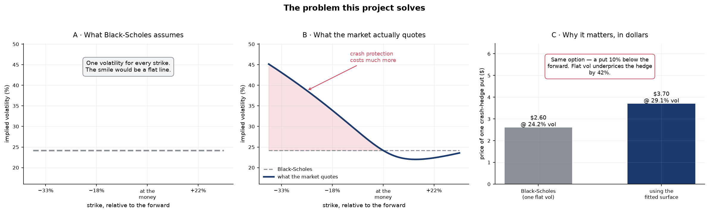
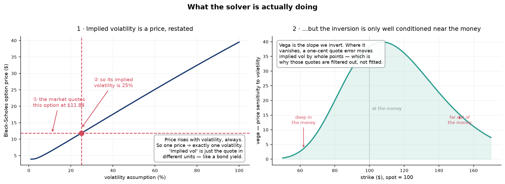
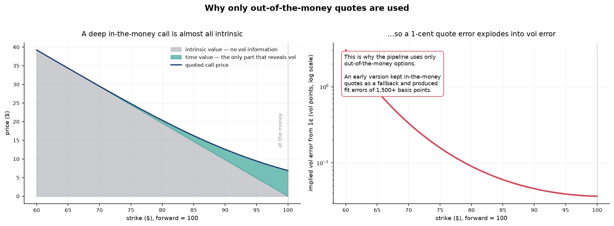
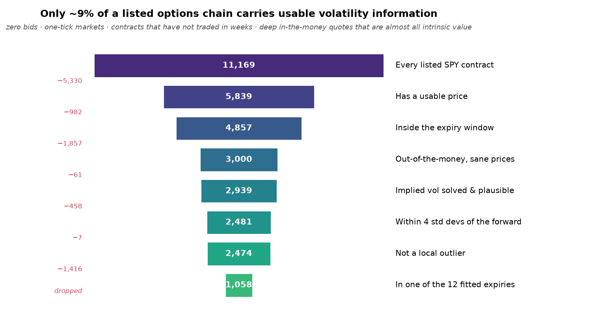
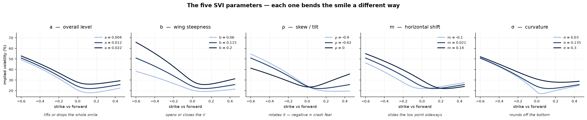
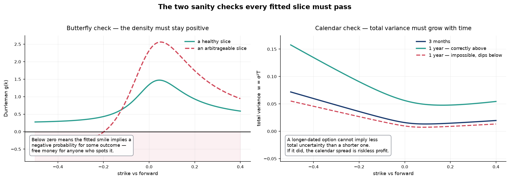
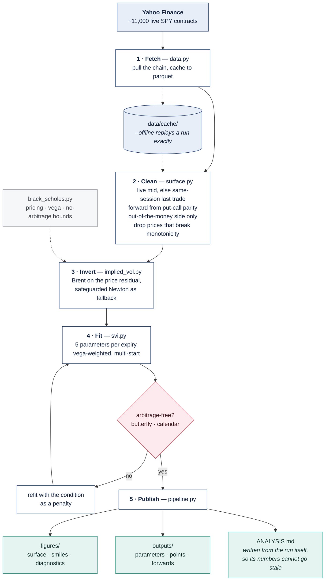

# Implied Volatility Surface + SVI Fit

<!-- project-history -->
> ### Project history
>
> **Implied Volatility Surface with SVI Calibration**  
> **June 2026 - Present** &nbsp;|&nbsp; Independent Quantitative Research
>
> Constructed an implied volatility surface from live equity-index options with raw SVI calibrated per expiry slice and full static-arbitrage diagnostics. Black-Scholes, the implied-volatility inversion, and the SVI fit were implemented from scratch.
>
> This repository was published to GitHub in August 2026. GitHub's repository
> creation date reflects when the code was uploaded here, not when the work was
> done. This is independent quantitative derivatives research rather than a standalone trading strategy.

[](https://github.com/crollila/implied-vol-surface-svi/actions/workflows/tests.yml)
[](https://www.python.org/downloads/)
[](LICENSE)
[](tests/)

Builds an implied-volatility surface from a live equity-index options chain and calibrates the
**raw SVI** parameterisation to every expiry slice, with full static-arbitrage diagnostics.

Everything — Black-Scholes pricing, greeks, the implied-vol root finder, the SVI model and its
calibrator — is implemented from scratch on top of NumPy and SciPy. No option-pricing library is
used anywhere.


*SPY, 2026-08-10 close. Left: the fitted surface in standardised moneyness. Right: the same
slices over the strike range each expiry actually quotes.*

### Results at a glance — SPY, 2026-08-10 close

| | |
|---|---|
| Listed contracts pulled | 11,169 |
| Surviving quote hygiene | 1,058 across 12 expiries |
| **Median fit error** | **15.2 vol bps** (bid/ask is 20–100 bps wide) |
| Core vs wings | 15.7 bps within 1σ of the forward, 30.2 bps beyond 2σ |
| Butterfly-arbitrage free | 12 / 12 slices |
| Calendar-arbitrage free | yes, on every adjacent pair |
| Runtime | ~9 s end to end |

Full write-up, with the reasoning behind each number: **[ANALYSIS.md](ANALYSIS.md)**.

---

## What this is, for anyone who doesn't speak options

Skip to [How it works](#how-it-works) if you already know what a vol surface is.

### The problem

Black-Scholes — the standard option pricing formula — needs one number as input: how volatile
you think the stock will be. Feed it a volatility, it gives you a price. **Run it backwards** and
a market price gives you back exactly one volatility. That number is the *implied volatility*: it
isn't a forecast, it's the market's price quoted in different units, the way a bond is quoted as
a yield.

Black-Scholes assumes that number is the *same* for every option on a stock. It isn't — not even
close. Options that pay off in a crash cost far more than the formula says they should.



Plot implied volatility against strike and you get a lopsided curve — the **volatility skew** —
not a flat line. Do that for every expiry date at once and the curve becomes a **surface**.
Building that surface, cleanly, from real market data, is what this project does.

### Why it isn't just arithmetic

Two things make it harder than running a formula backwards.

**Not every quote is trustworthy.** An option price only reveals volatility through the part of
its value that depends on volatility. For some options that part is almost the whole price; for
others it is a rounding error, and their implied volatility is meaningless noise.



That is the reasoning behind the single most consequential decision in the codebase — using only
*out-of-the-money* options, the ones with no built-in profit:



**And most of the chain is unusable.** Of ~11,000 listed SPY contracts, about 9% survive:



### The model

Rather than storing thousands of loose points, each expiry's curve is compressed into **five
numbers** using the SVI model. Each one bends the curve a different way:



Twelve expiries × five numbers = 60 numbers that reproduce 1,058 market quotes to within a
fraction of the bid/ask spread.

### The sanity checks

A curve that fits the data can still be nonsense — it can imply a negative probability, or that
uncertainty *shrinks* with time. Both would be free money for anyone who noticed. Every fitted
slice is tested for both:



### How the pieces fit together



Every arrow above is covered by tests: the suite builds a synthetic options chain from a known
surface, pushes it through the whole pipeline, and checks the original surface comes back out.

---

## What this demonstrates

*(for a reader skimming a CV)*

This project takes a real, messy options chain and turns it into something a trading desk could
price off. It pulls roughly eleven thousand live SPY contracts, throws away the ~90% that carry
no usable volatility information — zero bids, stale prints, deep in-the-money quotes whose
implied vol is dominated by tick size — recovers each expiry's forward from put-call parity
rather than guessing a dividend yield, inverts Black-Scholes for every surviving quote with a
bracketed Brent solver, and calibrates a five-parameter SVI curve to each of twelve expiries.
The result reproduces the market to a **median 15 basis points of volatility**, comfortably
inside the bid/ask spread, and every fitted slice passes a Durrleman butterfly-arbitrage check
and a cross-maturity calendar-arbitrage check. The work is in the parts that are easy to get
wrong and hard to notice: the data hygiene, the forward, the choice of which side of each strike
to trust, and knowing which arbitrage conditions a slice-by-slice fit does and does not
guarantee. It ships with 143 tests, including an end-to-end test that generates a synthetic
chain from a known surface and checks the pipeline recovers it.

---

## Quick start

```bash
python -m venv .venv && .venv/Scripts/activate    # Windows
python -m venv .venv && source .venv/bin/activate # macOS / Linux
```

```bash
pip install -e ".[dev]"
```

```bash
python -m volsurface --ticker SPY --rate 0.04
```

That single command runs the whole pipeline: fetch → clean → invert → calibrate → plot → report.
It takes about ten seconds once the chain is cached.

Re-run the identical analysis offline, from the committed snapshot:

```bash
python -m volsurface --ticker SPY --rate 0.04 --offline
```

Run the tests:

```bash
pytest
```

### Outputs

| Path | What |
|---|---|
| `figures/surface_3d.png` | Fitted surface (3D) + smiles over their real strike ranges |
| `figures/smiles.png` | Per-expiry market IV vs fitted SVI curve |
| `figures/term_structure.png` | ATM vol, skew, total variance and RMSE by maturity |
| `figures/fit_diagnostics.png` | Residuals and Durrleman `g(k)` curves |
| `figures/explainer_*.png` | The illustrations above — `python -m volsurface.explainers` |
| `outputs/svi_params.csv` | Fitted `a, b, ρ, m, σ` + RMSE and diagnostics per expiry |
| `outputs/surface_points.csv` | Every clean quote: price used, its source, IV, fitted IV, residual |
| `outputs/forwards.csv` | Per-expiry forward and how it was obtained |
| [`ANALYSIS.md`](ANALYSIS.md) | Generated write-up of the skew, term structure and departure from flat-vol BS |

`ANALYSIS.md` is regenerated on every run, so every number in it comes from the run that
produced the figures beside it.

### Staying current

A [scheduled workflow](.github/workflows/update-surface.yml) re-runs the pipeline against live
quotes at **17:00 UTC each weekday** — mid-session in New York — and commits the refreshed
figures, tables and write-up.

GitHub's cron is UTC-only and knows nothing about market holidays, so the job does not trust its
own schedule. It inspects the data it actually received and commits only when most points came
from live two-sided markets, which is the observable signature of an open market. On a holiday it
reports what it saw and changes nothing. You can also trigger it by hand from the Actions tab,
with a dry-run option that fits but does not commit.

---

## The model

Raw SVI (Gatheral, 2004) models **total implied variance** `w = σ²T` as a function of
log-moneyness `k = log(K/F)`:

```
w(k) = a + b · ( ρ(k − m) + √((k − m)² + σ²) )
```

| | |
|---|---|
| `a` | vertical level — roughly the ATM total-variance floor |
| `b` | wing steepness (the angle between the two asymptotes) |
| `ρ` | skew: negative tilts the smile down-and-right, the equity-index norm |
| `m` | horizontal shift of the smile's vertex |
| `σ` | curvature at the vertex; `σ → 0` gives a kinked V |

Asymptotically `w(k) ~ a + b(1±ρ)|k − m|`, so the wing slopes are `b(1±ρ)`. Roger Lee's moment
formula caps those at 2, which is where the bound on `b` comes from.

---

## How it works

**1 · Data** (`data.py`) — pulls the chain and spot via `yfinance`, writes it to parquet with a
`meta.json` recording the spot and the exact pull timestamp. Every later run can be reproduced
byte-for-byte with `--offline`.

**2 · Price selection** (`surface.py`) — prefers the bid/ask mid of a live two-sided quote. Since
venues withdraw quotes outside market hours, it falls back to the last traded price *only* for
contracts that printed in the most recent session. Which source each point used is recorded and
reported.

**3 · The forward** — recovered per expiry from put-call parity, `F = K + e^{rT}(C − P)`, taken as
a median over near-the-money strikes and sanity-checked against cost-of-carry. This removes any
dependence on a dividend forecast: the listed market prices the forward directly, so the smile
is centred on the market's own dividend and repo assumptions rather than ours.

**4 · Which quote to trust** — out-of-the-money only: puts below the forward, calls above. An OTM
option is pure time value, so its price is almost all volatility information. A deep ITM call is
almost all intrinsic — a one-tick quote error moves its implied vol by whole vol points. *(An
early version of this pipeline included the ITM side as a fallback and produced fit errors of
1,500+ bps. That single change was the difference between a broken surface and a working one.)*

**5 · Static-arbitrage filtering** — OTM put prices must rise with strike and call prices must
fall. Asynchronous last trades break this routinely, so the code keeps the **largest mutually
consistent subset** on each side (a longest-monotone-subsequence scan) rather than sweeping once
and discarding a long run of good quotes after a single bad one.

**6 · Inversion** (`implied_vol.py`) — rejects quotes outside the static no-arbitrage price
bounds, brackets the root, then runs **Brent** on the price residual. If bracketing fails, a
**safeguarded Newton** using analytic vega takes over, with a bisection guard so a vanishing vega
cannot throw the iterate off. Failures return `nan` plus a machine-readable reason; one bad row
never kills a run.

**7 · Calibration** (`svi.py`) — bounded nonlinear least squares on total variance, vega-weighted,
with multi-start initialisation and an **analytic Jacobian**. Two-stage: every start is run
cheaply, only the best three are polished to machine precision. Non-negativity of variance is a
stiff soft constraint.

**8 · Arbitrage checks** — Durrleman's `g(k) ≥ 0` (butterfly / non-negative risk-neutral density)
is scanned on a dense grid past the quoted range; any slice that fails is automatically refit
with the condition as a penalty targeting a strictly positive margin. Calendar arbitrage
(`w(k,T)` non-decreasing in `T`) is checked on the **overlap of each adjacent pair's fitted
range** — comparing two SVI curves where both are extrapolating measures the parameterisation's
tail behaviour, not a tradeable arbitrage.

---

## Design decisions worth defending

**Standardised moneyness in the 3D plot.** Quoted strike width grows with maturity — a one-week
slice spans `|k| < 0.06`, an 18-month slice `|k| < 0.8`. Any shared raw-`k` axis is therefore
either a sliver or mostly empty. Rescaling to `z = k / (σ√T)` puts every slice on a comparable
footing and is the more meaningful comparison anyway: `z` measures how far out of the money an
option is *relative to what could plausibly happen* by expiry. The raw-`k` view is kept in the
second panel so nothing is hidden.

**A maturity-scaled wing cutoff.** `k = −0.3` is a twenty-sigma lottery ticket on a one-week
option and barely out of the money on a two-year one. Trimming at a fixed log-moneyness would
apply wildly different standards across the term structure, so the cutoff is `4·σ√T`.

**Fitting total variance, not implied vol.** Total variance is the quantity SVI is defined on and
the one the no-arbitrage conditions are stated in. Errors are reported in vol basis points
anyway, because that is what a trader reads.

**Slices are fitted independently.** This is the honest limitation, and it is why calendar
arbitrage is *checked* rather than assumed away. Eliminating it by construction needs a jointly
calibrated surface (SSVI/eSSVI, where a single monotone `θ(T)` enforces the ordering). That is
the natural next step, not something this code pretends to do.

---

## Project layout

```
src/volsurface/
  black_scholes.py   pricing, greeks, no-arbitrage price bounds
  implied_vol.py     Brent + safeguarded Newton inversion
  surface.py         cleaning, forwards, OTM selection, surface assembly
  svi.py             raw SVI, calibration, Durrleman & calendar checks
  plotting.py        the four result figures
  explainers.py      the illustrated walkthrough above
  reporting.py       generates ANALYSIS.md from the run
  pipeline.py        orchestration
  cli.py             argument parsing and entry point
tests/               143 tests, all offline
.github/workflows/
  tests.yml          pytest on Linux + Windows, Python 3.11 & 3.12
  update-surface.yml weekday mid-session refresh, commits the result
figures/  outputs/   generated
data/cache/          parquet snapshots (the three most recent are kept)
```

## CLI reference

```
--ticker SPY              underlying symbol
--rate 0.04               continuous risk-free rate
--dividend-yield 0.012    fallback only; the forward is normally implied
--no-imply-forward        use spot·e^((r−q)T) instead of put-call parity
--min-days 7              drop expiries nearer than this
--max-days 550            drop expiries beyond this
--max-expiries 12         cap on slices, spread across the term structure
--min-price 0.05          minimum acceptable premium
--max-rel-spread 0.60     maximum (ask−bid)/mid
--no-last-trade           require live two-sided quotes
--max-trade-age 1         sessions a last trade may be and still count as fresh
--max-sd 4.0              wing cutoff in standard deviations
--min-points 8            minimum quotes to fit a slice
--min-wing-points 3       minimum quotes each side of the forward
--no-vega-weight          fit with equal weights
--n-starts 24             multi-start count
--offline / --refresh     cache-only / force a fresh pull
```

## Notes and limitations

Yahoo Finance data is delayed and, outside market hours, largely unquoted — the committed
snapshot is an end-of-day mark built from last trades, and a run at a different time of day will
not reproduce it exactly. SPY options are American while the pricing here is European; using the
OTM side of each strike keeps the early-exercise contamination small but not zero. Rates are a
single flat number rather than a curve. `ANALYSIS.md` discusses each of these in context.

## References

- Gatheral, J. (2004). *A parsimonious arbitrage-free implied volatility parameterization.*
- Gatheral, J. & Jacquier, A. (2014). *Arbitrage-free SVI volatility surfaces.* Quantitative Finance 14(1).
- Lee, R. (2004). *The moment formula for implied volatility at extreme strikes.* Mathematical Finance 14(3).

## License

MIT
